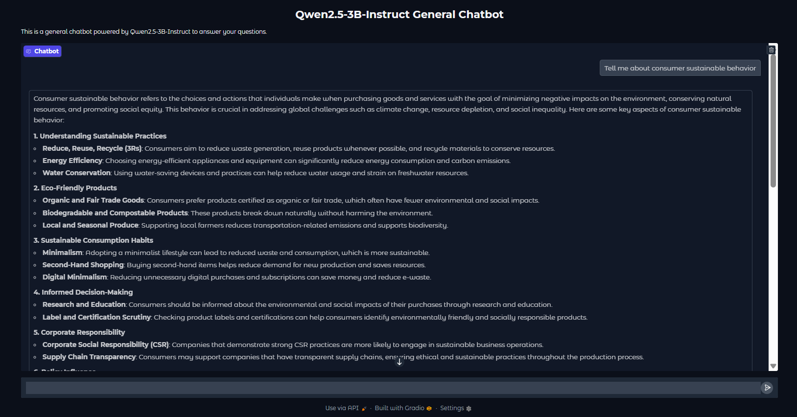
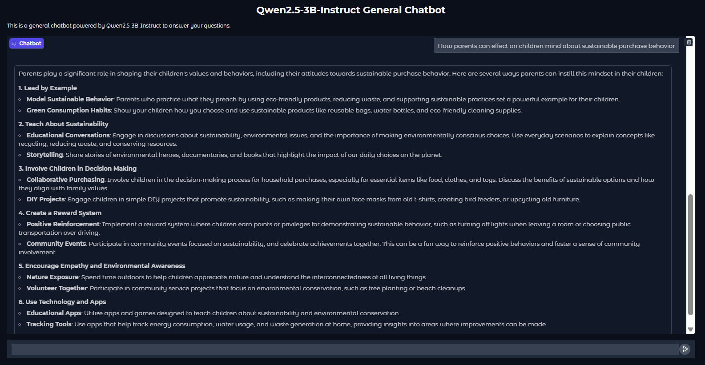

# Qwen2.5-3B-Instruct Chatbot

[](https://www.linkedin.com/in/pejman-ebrahimi-4a60151a7/)
[](https://huggingface.co/arad1367)
[](https://arad1367.github.io/pejman-ebrahimi/)
[](https://www.uni.li/pejman.ebrahimi?set_language=en)

## Table of Contents

- [Overview](#overview)
- [Features](#features)
- [Model Information](#model-information)
- [Installation](#installation)
- [Usage](#usage)
- [Demo](#demo)
- [Requirements](#requirements)
- [License](#license)
- [Contact](#contact)

## Overview

This repository contains a simple yet powerful chatbot implementation using the Qwen2.5-3B-Instruct model from Alibaba Cloud. The chatbot is built with Gradio, providing an easy-to-use web interface for interacting with the model.

## Features

- Clean and intuitive Gradio web interface
- Conversation memory to maintain context
- Customizable system prompt
- Example prompts to get started
- Support for both CPU and GPU inference
- Easy deployment locally or via sharing links

## Model Information

The chatbot uses [Qwen2.5-3B-Instruct](https://huggingface.co/Qwen/Qwen2.5-3B-Instruct), a 3 billion parameter instruction-tuned language model from the Qwen2.5 series by Alibaba Cloud. This model offers:

- Strong performance in instruction following
- Support for generating up to 8K tokens
- Context length of up to 32K tokens
- Multilingual capabilities (29+ languages)
- Improved capabilities in coding and mathematics

## Installation

### Prerequisites

- Python 3.8 or higher
- pip package manager

### Setup

1. Clone the repository:

```bash
git clone https://github.com/arad1367/qwen-chatbot.git
cd qwen-chatbot
```

2. Create and activate a virtual environment (optional but recommended):

# On Windows

`python -m venv venv`
`venv\Scripts\activate`

# On macOS/Linux

`python -m venv venv`
`source venv/bin/activate`

3. Install the required dependencies:
   `pip install -r requirements.txt`

### Usage

Run the application with:
`python app.py`

The Gradio interface will start locally and provide:

- A local URL (typically http://127.0.0.1:7860)
- A public sharing link (if you're running with share=True)
- You can then interact with the chatbot through your web browser.

### Demo


_Screenshot of the chatbot interface_


_Example conversation with the chatbot_

### Requirements

The main dependencies are:

- gradio
- transformers
- torch
  For the complete list, see the requirements.txt file.

### License

This project is licensed under the MIT License

### Contact

- Email: pejman.ebrahimi77@gmail.com
